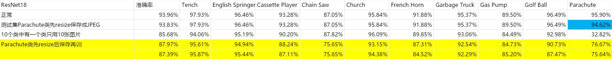
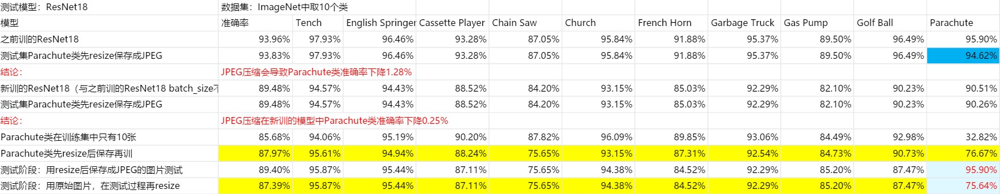

# The accuracy loss of JPEG compression.

* 本仓库用于测试.jpg压缩对最终的模型准确率的影响。

## 实验结果

## 实验结论

1. 如果只在测试的过程先进行JPEG压缩，准确率会有下降，但不明显（1.28%/0.25%） 

2.  如果训练集都是固定size，例如(224, 224)， 测试集是随机size,在inference阶段再resize， 准确率会明显下降（95.90%->75.64%) 
3.  说明如果训练集的input size 固定，测试集的input size不固定，效果会有比较大的gap 
4.  该实验说明了，训练集resize保存成jpeg， 测试集不resize对最终结果影响较大。说明在收集数据时，不应该提前resize成固定尺寸并保存为jpeg， 但可以保存为png 